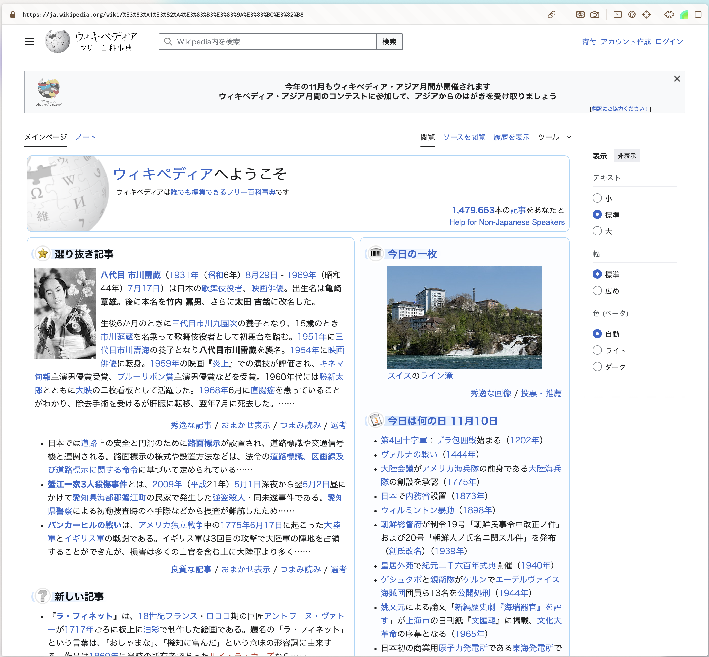
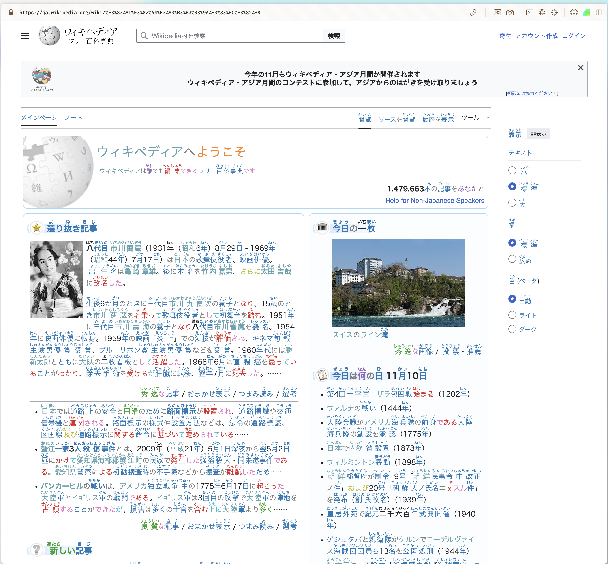
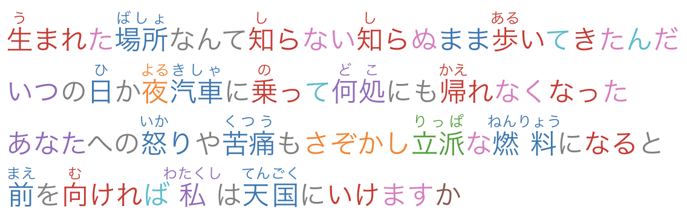

# Complexa

Complexa is a Chrome extension that helps you read and understand Japanese text on any web page. It provides on‑page readings, dictionary lookups and other tools that can be toggled from a compact popup.


## Features

- **Readings** – Overlay furigana or romaji above each token on the page.
- **Dictionary** – Highlight a word to see definitions in a floating tooltip.
- **Reading helpers** – Colour coded Universal Part of Speech hints and morphological data on hover.
- **Word filters** – Exclude specific words from annotation and persist the list across browsers.
- **Custom reading type** – Choose between *hiragana*, *katakana* or *romaji*.

All features can be toggled from the popup and settings are saved using Chrome sync.

### How It Works

Complexa injects content scripts that send page text to a tokenizer service. Each
token is wrapped in a `<span>` with metadata for readings, part of speech and
offset. When you click **Add Readings** the extension converts these readings
using Wanakana and displays them inline. The dictionary functionality is accesed using the wrapper of Jisho.

## Getting Started

1. Install dependencies
   ```bash
   npm install
   ```
2. Build the TypeScript source
   ```bash
   npm run build
   ```
3. (Optional) Rebuild automatically on changes
   ```bash
   npm run watch
   ```

### Load in Chrome

1. Open `chrome://extensions/` and enable **Developer mode**.
2. Click **Load unpacked** and select the dist folder that is generated at the moment of running code.
3. The Complexa icon will appear in your toolbar.

## Repository Layout

```
├── dist/                # Compiled JavaScript
├── src/                 # TypeScript source
│   ├── background/      # Service worker
│   ├── content/         # Content scripts
│   ├── models/          # Data models
│   ├── services/        # Chrome APIs wrappers
│   ├── ui/              # Popup and app logic
│   ├── viewmodels/      # MVVM view-models
│   └── views/           # UI components
├── static/              # HTML, CSS and icons
├── manifest.json        # Chrome extension manifest
├── webpack.config.js    # Webpack configuration
└── tsconfig.json        # TypeScript configuration
```

## Usage

1. Click the Complexa icon to open the popup.
2. Toggle the features you want and adjust the reading type.
3. Press **Add Readings** to annotate the current tab.
4. Launch the full page app for future features.

## Screenshots
### Before adding helpers

This is wikipedia before using complexa, as a native japanese speaker this might be easy to ready,
but as a learner is pretty hard.

### After adding helpers


The difference with the raw wikipedia is now that every part of the language (verbs, nouns, adjectives i.e)
are colored depending on the detection made by the underlying foundational model.

### Close view


This is a paragraph from the Japanese artist Ado, in this sample all verbs are colored red, nouns become blue,
adjectives green, etc. The colors are customizable and you can select which portions to turn off.

### Close view


Each token has a hover than can be disabled or enabled where you can see linguistic properties of
each of the tokens.

### Close view


Directly from jisho the definitions for certains tokens can be looked directly witout leaving the website.

## Acknowledgments
*  Kim, Miwa and Andrew for [Jisho](https://jisho.org)
* Megagon labs for developing of the Ginza model
* Saul Isaac Sanchez Hernandez and Rosa Maria guadalupe avila sandoval for helping with some parts of the frontend and presentation to the university.
* All the other Open Source projects that this project is built on.

Complexa is still under active development, but the core reading and dictionary functions should be stable. Contributions and feedback are welcome!
